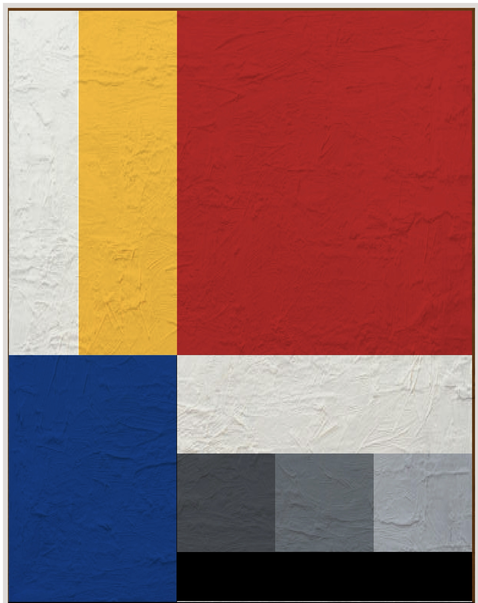

<!DOCTYPE html>
<html>

<body>

<h3>Recreation/Interpretation of De Stijl 1 by Peter Keler (1922)</h3>

In this project I used display: grid and an image overlay to recreate the image's structure and texture.

</body>
